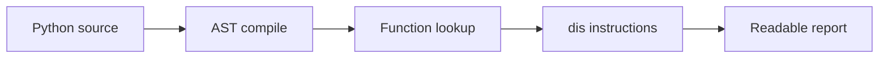

# Byteboard

Tiny Python bytecode explorer that explains what a short function turns into.

Byteboard is a developer-tool experiment for understanding Python internals. Give it a `.py` file and a function name; it prints bytecode instructions, constants, names, and a compact control-flow edge list.

```bash
PYTHONPATH=src python3 -m byteboard samples/snippet.py score_move
PYTHONPATH=src python3 -m unittest discover -s tests
```

## How It Works



The project uses only the Python standard library: `ast`, `dis`, and `types`.

## Architecture

- `loader.py`: compiles a source file and extracts one function
- `inspect.py`: turns bytecode into serializable instruction data
- `report.py`: formats the bytecode and branch edges
- `cli.py`: command-line entry point

## Demo

```bash
PYTHONPATH=src python3 -m byteboard samples/snippet.py score_move
```

## Why I Built This

I like tools that make hidden systems visible. Byteboard is small, but it shows curiosity about compilers, debugging, and how programming languages actually run.

## Future Ideas

- HTML control-flow graph
- Compare bytecode across Python versions
- Highlight expensive operations
- Add Java bytecode support later

## GitHub

Description: Tiny Python bytecode explorer for learning how functions execute.

Topics: `python`, `bytecode`, `developer-tools`, `debugging`, `programming-languages`
